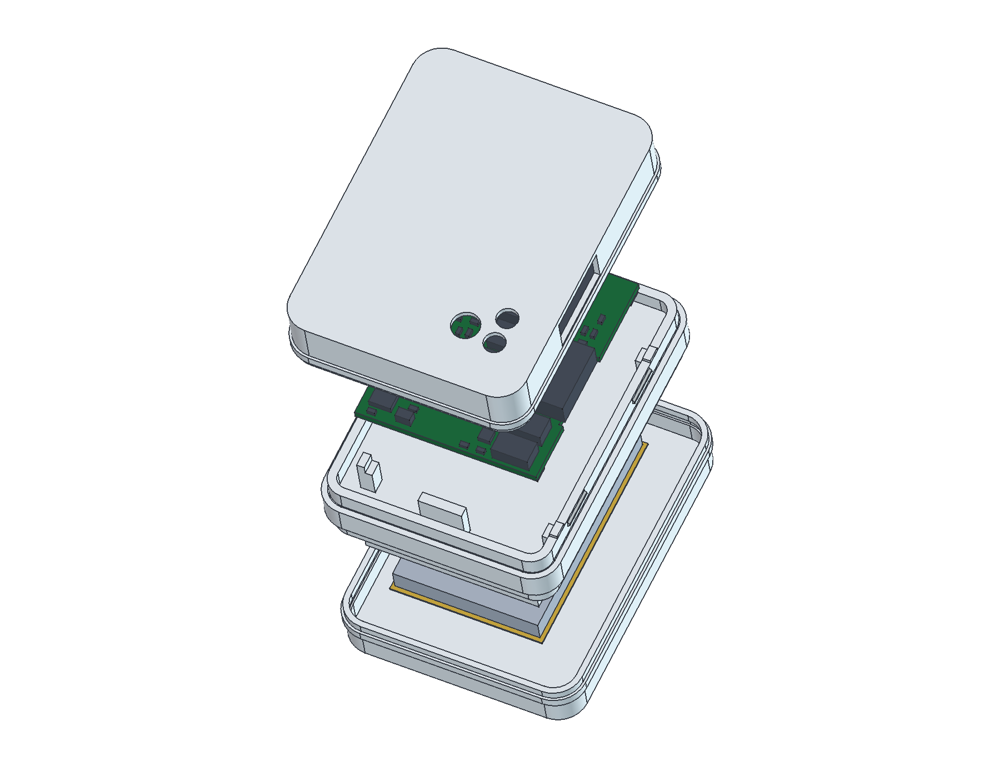

# sMove — screwless PCB + three-piece enclosure

**Current review: white rounded Midframe + Top cover + Bottom cover. No screws, nuts, inserts or PCB enclosure-mounting holes. Default outer wall 0.8 mm; configurable and checked at 1.2 mm. No merge, manufacturing release or charging release.**

- [Current enclosure and regeneration](housing/README.md): opposite-side battery/PCB pockets, insulated support, optional PCB adhesive, screwless sleeve/snap covers and an explicit west battery-wire passage to BAT pads.
- [PCB](PCB/main/README.md): targeted H1/keepout removal and copper refill; all 1,726 tracks and 97 vias preserved. Circuit, pad geometry, aligned buttons, antenna rules and battery interface unchanged.
- [Revision evidence](docs/revision-r2/screwless/README.md): fresh configured DRC/ERC, full native comparisons, manifold solids, collision/access checks, actual wall variation, FreeCAD images and hash manifests.
- [Printing/assembly and physical gates](housing/PRINTING-ASSEMBLY.md): actual pack/lead exit, insulation/adhesive, print supports, snap fit/creep, PCB deflection and charging qualification still required. No proven physical fit.

Default envelope including snap reinforcement: **44.3 L × 33.3 W × 19.0 H mm**. Accepted 30×20×3 mm battery candidate / 31×21×4.3 mm complete-pack allowance retained, behind the north antenna exclusion. Main underside faces the body; IMU +Z remains outward. LED, RESET/BOOT and USB-C accesses align to the current native PCB.

Previous [button alignment](docs/revision-r2/button-alignment/README.md), [PCB repair](docs/revision-r2/pcb-repair/README.md), and [two-part case](docs/revision-r2/two-part-case/README.md) records are historical snapshots, not current assembly instructions. Unrelated electronics and history are preserved.

