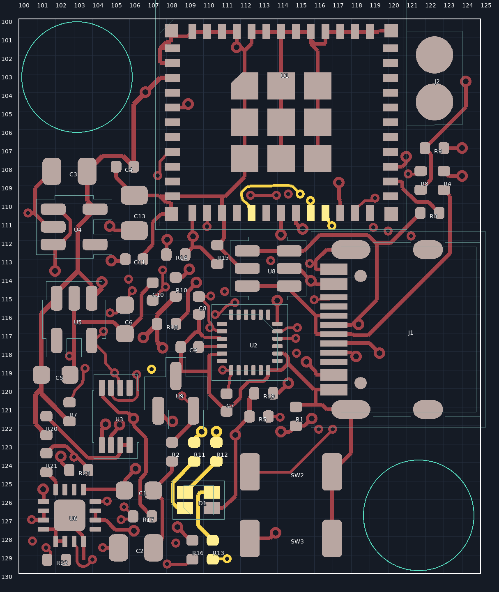
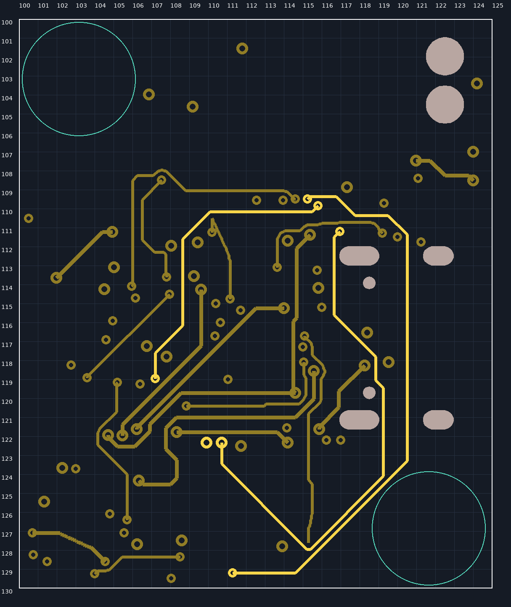

# LED routing on the user's revised layout

Base: `b155f033f849d78e28f899b0d9df355177c8b5ed` ("Add a different routing setup"). The native board is `PCB/main/smove-r2-main.kicad_pcb`.

## Changes

- Completed the three missing ESP32-to-resistor connections: U1.20 → R11.1 (red), U1.21 → R12.1 (green), U1.16 → R13.1 (blue). Existing R11/R12/R13-to-D1 cathode routes and D1.4 common-anode 3.3 V connection are preserved.
- Kept D1 at native `(109.725, 126.025)` mm, 90°, on the front. Relocation was not necessary; all 47 footprints, including the ESP32 and LED resistors, are exactly unchanged.
- Added 36 signal segments (0.15 mm), three signal vias (0.45 mm copper / 0.20 mm drill), and one GND stitching via at `(103.0, 123.7)` mm. The blue escape via is beside R13, **not in its solder pad**. Routing uses F.Cu, In2.Cu and B.Cu; no signal tracks were added on the In1 GND reference plane.
- The GND stitch connects the isolated R21/R23 front-copper region exposed by a fresh refill. No zone island-removal settings or electrical rules were relaxed.
- Removed the obsolete, open-ended BOOT branch that extended into the bottom-right screw reserve: 13 In2 segments, its redundant via, and four front escape segments back to the U1 pad. The working BOOT circuit is preserved and connectivity/parity verified. All other **1,072 existing track/via objects** are token-identical to the base.

## Screw space

Two rule areas now reserve a **6.0 mm diameter clear disk** for each future M3 mounting location:

| Location, viewed from front | Native centre (mm) | Rule area |
|---|---|---|
| Top left | X103.15, Y103.15 | `M3_NW_RESERVE` |
| Bottom right | X121.65, Y126.85 | `M3_SE_RESERVE` |

Both exclude tracks, vias, pads, copper pours and footprints on all four copper layers. The actual 96-sided keepout outline is circumscribed with a 0.005 mm radial allowance so polygon/nanometre rounding cannot encroach on the 6.0 mm clear disk. Verification checks actual tracks, pads, footprint courtyards and refilled copper against those disks.

**No mounting holes were drilled/added.** These are reserved positions, not a finalized fastener design. Hole diameter, screw head/washer envelope and enclosure alignment must be checked for the selected M3 hardware before manufacture. The antenna exclusion and the pre-existing corner keepouts are unchanged.

## Verification

Run from the repository root:

```sh
/usr/bin/python3 scripts/r2/main/verify_led_routing.py --output .cache/led-route/verification
```

The verifier compares exact native tokens to the base commit, checks net mappings and screw reserves, and runs fresh KiCad DRC with all track errors, all severities and schematic parity enabled.

| Check | Base | Routed board |
|---|---:|---:|
| Unconnected items | 3 (all LED) | **0** |
| DRC error-severity violations (excluding the separate unconnected list) | 0 | **0** |
| Schematic parity issues | 0 | **0** |
| Warnings | 8 | **3** |

The three remaining warnings are unchanged from the base:

- J2 embedded footprint differs from the library copy.
- Existing dangling USB CC2 via at `(116.25, 122.2)` mm.
- Existing dangling IMU SCL_1V8 track at `(115.3, 127.6)` mm.

See `baseline-drc.json`, `drc.json` and `verification.json`. No new exclusions, ignored severities or weakened clearances were introduced.

## Review images and release scope

The PNGs are native-geometry inspection diagrams with pours omitted for trace visibility: yellow highlights LED nets; teal circles indicate the nominal clear disks. They are not fabrication artwork. Native KiCad SVG plots include the actual copper pours.





This is a native-PCB routing change, **not a manufacturing release**. Existing `PCB/main/dist/` Gerbers, assembly files, 3D exports and the enclosure describe older revisions and were not regenerated by this task. Do not manufacture from that old bundle; regenerate and review it from the updated board first. No enclosure files or schematic files were changed.
