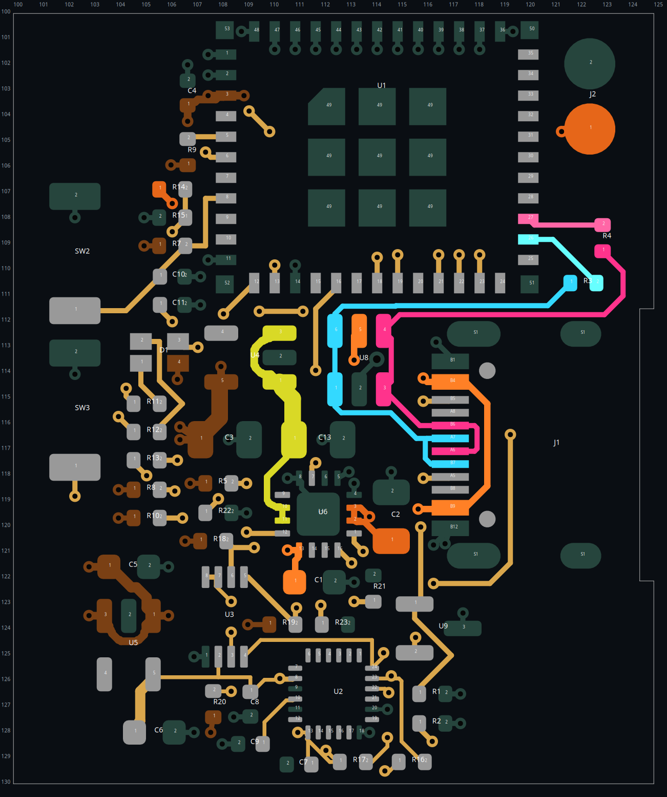
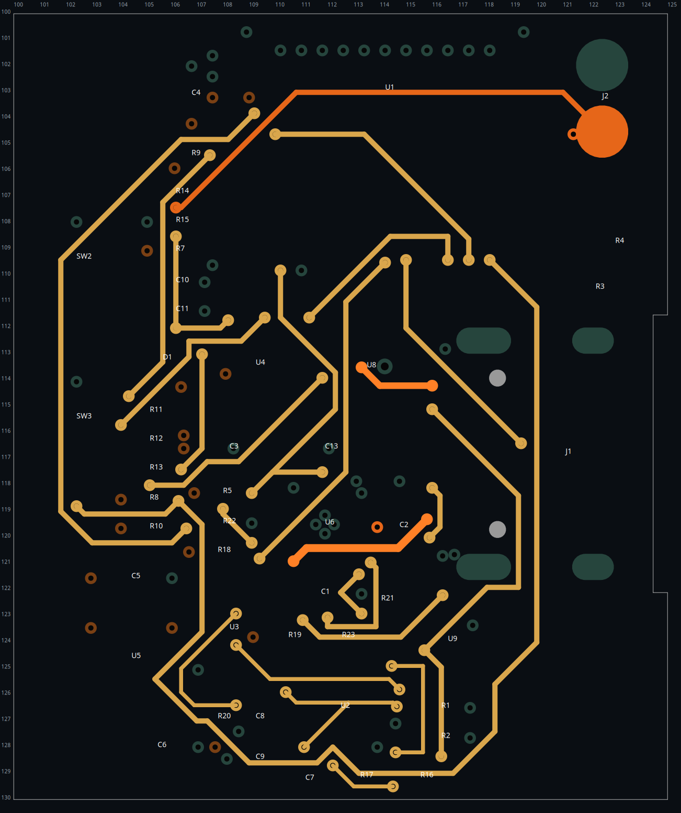
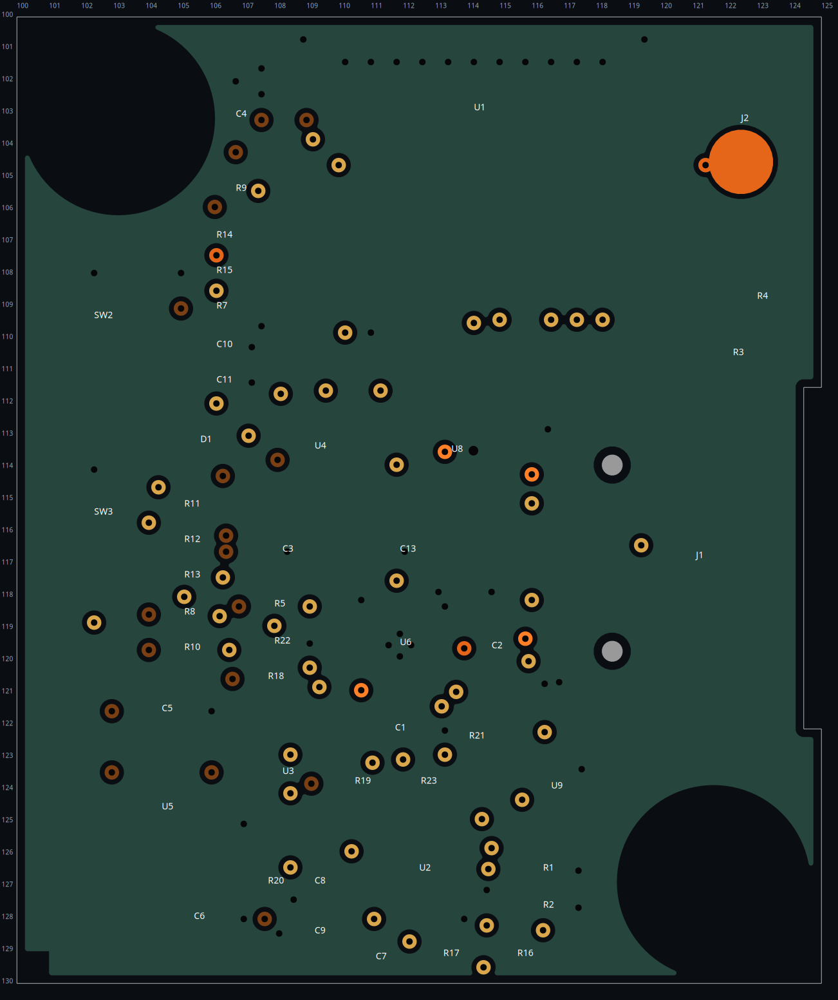
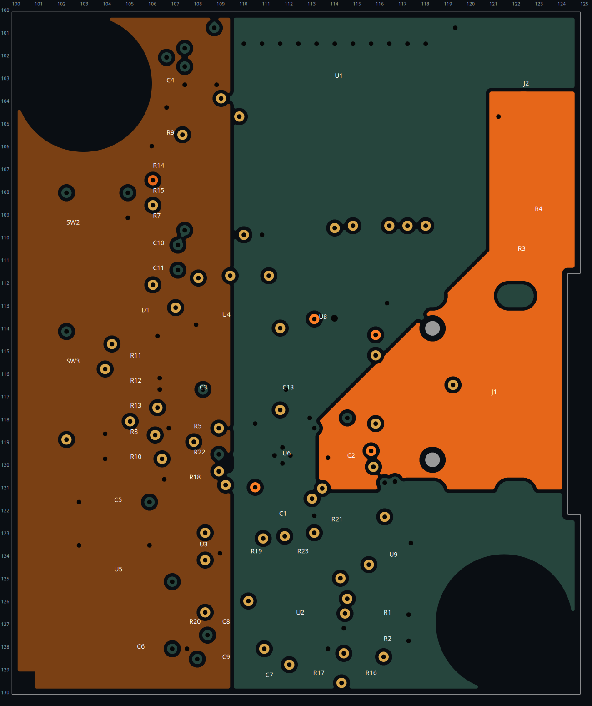

# Main-board routing completion — review candidate

The authoritative PCB is `PCB/main/smove-r2-main.kicad_pcb`. This revision resumes the user's saved rotated-U8 routing, **not** the rejected USB seed. The latter generator is disabled.

## Verified result

- **0 DRC errors, 0 unconnected items, 0 schematic-parity issues, 0 ERC violations.**
- One unchanged warning: J2's battery-wire footprint differs from its library copy. No exclusions or rule weakening were added.
- **411 F.Cu segments, 104 B.Cu segments, 125 through vias, 47 footprints.**
- Every user USB data segment is preserved; the missing U1:26 → R3:2 connection is completed. The two old dangling D+ vias were removed. USB data remains entirely on F.Cu.
- U8 remains at the user's 90° orientation. **C7 alone is rotated 180°**, in place, to give its ground pad access to the connected ground pour and simplify its supply feed. All pad numbers/nets/sizes, other component placements, outline, antenna rules, IMU under-package keepout and reserved M3 regions are retained.
- Complex fanouts were placed with explicit coordinates. IMU SDA/power escapes and CC2 routing were moved to free the SCL route; VBUS and nearby ground stubs were changed to free the charger TS connection. No net was reassigned.
- A subsequent native-DRC-gated cleanup simplified 17 chains. Long BOOT and STRAP8 routes still take perimeter detours: connectivity and clean straight sections are verified, **global route-length optimality is not claimed**.

Evidence: [verification.json](verification.json), [DRC](drc.json), [ERC](erc.json), [cleanup](polish.json), [tool tests](tool-tests.txt), and [C7 comparison](c7-rotation-comparison.json). Comparison paths refer to temporary review copies, not release files.

## Plane selection

| Layer | Implemented use |
|---|---|
| F.Cu | Components, USB data, short local connections and selected signal bridges; connected GND pour |
| In1.Cu | Unbroken GND reference, one filled region; no routed traces |
| In2.Cu | Bounded 3V3_MAIN and PACK_P power-distribution regions, GND elsewhere; no routed traces |
| B.Cu | Signal routing and local power links, through-via transitions; connected GND pour |

The PACK_P region replaces the battery trunk that previously cut diagonally through the bottom routing area. Its upper end contacts J2's plated battery pad; its lower end feeds the charger/battery capacitor escape. The long thin PACK_P branch to R14 is the low-current voltage-sense branch, not the main charger feed. The 3V3 region distributes power on the left side without cutting the In1 reference.

A signal/GND/power/signal stack requires attention to reference-plane splits: bottom-side fast signals must not casually cross splits, and signal transitions need local return paths. Espressif recommends a complete GND reference and minimizing USB layer transitions; the power layer need not be indiscriminately divided into many rails. [source](https://docs.espressif.com/projects/esp-hardware-design-guidelines/en/latest/esp32c3/pcb-layout-design.html) [source](https://resources.altium.com/p/right-way-use-power-planes-4-layer-pcb-stackup)

Here USB remains on top, over In1 GND. Sampling its copper centerlines every 0.05 mm found **1,015 samples, zero uncovered**. This verifies reference coverage, not impedance or electromagnetic performance. Bottom I2C, configuration and control routes still require return-path/edge-rate review around the In2 power boundaries; no new fast USB routing was placed there.

The charger datasheet calls for short bypass loops, appropriately sized current paths and thermal-pad grounding. Four original thermal vias are retained; a final fabrication/thermal assessment is still required. [source](https://www.ti.com/lit/ds/symlink/bq24074.pdf)

## Reusable tools

See [scripts/pcb_tools/README.md](../../../scripts/pcb_tools/README.md):

- `waypoints` / `recipe`: exact coordinates, explicit vias and layers, selected copper removal and explicit footprint rotation; no pathfinding.
- `route`: exact two-pad routing, bend-aware search, short fanouts and bottom routing.
- `rotate`: isolated orientation/position comparisons with PNGs, DRC and approximate connection-length scores.
- `polish`: clearance-checked chain simplification with per-change connectivity/DRC rollback.
- 21 regression tests cover geometry, both routing layers, vias, locked copper, no partial insertion, stale plans and source/output guards. Orientation comparisons use isolated processes to avoid the installed native bindings' multi-board lifetime problems.

`manual-*.json` files are intermediate, UUID-specific audit recipes, not a regeneration pipeline. In particular, `manual-short-host.json` was an evaluated alternative **not adopted** because it increased detours. Do not replay recipes against the completed PCB.

Recheck the current board:

```sh
/usr/bin/python3 scripts/r2/main-routing/verify.py
PYTHONPATH=scripts /usr/bin/python3 -m unittest pcb_tools.test_tools -v
kicad-cli sch erc --format json --severity-all \
  -o docs/revision-r2/main-routing/erc.json PCB/main/smove-r2-main.kicad_sch
```

## Release limitations

This is a **routed review candidate, not a fabrication, assembly or charging release**. Native connectivity/DRC does not establish controlled USB impedance/skew, current capacity, RF/EMC performance, thermal margins, cell protection/temperature sensing or enclosure fit. Confirm the fabricator's actual stackup, via/plating and assembly requirements and review the relatively long low-speed detours before release. Existing `PCB/main/dist/` manufacturing outputs and enclosure openings are stale and were not regenerated. Firmware still needs the previously documented RED LED GPIO3 reassignment.

## Review images





