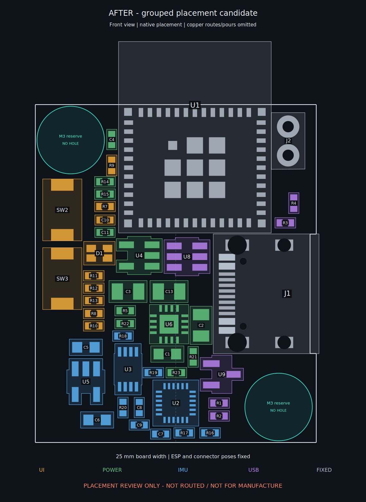

# Grouped placement and routing study — UNROUTED REVIEW

**This is a placement-stage revision, not a completed reroute.** The working main PCB has been rearranged and the old copper routes removed instead of leaving tracks attached to the wrong pads. There are **152 unconnected items**. The copper-zone definitions are retained but unfilled; the proposed power-plane strategy below is **not implemented or electrically verified yet**. Do not fabricate, assemble or charge from this candidate.

Native file: `PCB/main/smove-r2-main.kicad_pcb`. Baseline: `7128028`. This work is isolated on the chat workspace branch; the original project directory and its locally modified project preferences were not overwritten. No enclosure or manufacturing exports have been regenerated.

## Placement delivered



- **Fixed:** U1 ESP32-C3-MINI-1, J1 USB-C, J2 battery connection, board outline, four-layer/1 mm nominal board, antenna exclusion and both M3 reserves. The reserves remain at `(103.15, 103.15)` and `(121.65, 126.85)` mm, each a 6 mm clear disk. **These are existing reserved positions, not actual drilled screw holes.** No holes were added or moved.
- **Upper left:** SW2 RESET and SW3 BOOT form a vertical column below the NW reserve. D1 and R11/R12/R13 sit beside it, close to the ESP's lower-left corner. R7/C10 and R8 stay with the reset/boot area. The native RESET silk is abbreviated `RST` to fit without reducing the configured minimum text height.
- **Power:** U4 and U6, C1/C2/C3/C13 and the charger programming/status resistors are grouped below the ESP and immediately left of USB. C4 remains beside the ESP supply input rather than being moved away with the charger. The ADC divider/filter is beside the ESP.
- **IMU:** U2 moves from `(112.5, 117.5)` to `(112.5, 126.5)` mm: **same centreline, 9 mm down, same −90° orientation and front-side +Z direction**. U3/U5 and all IMU capacitors/pull-ups form the lower sensor group. C7/C8/C9 are beside U2's VDD/VDDIO/REGOUT sides.
- **USB:** the USB connector and its data protection U8 retain their placements; R3/R4 remain beside the ESP's USB pins. CC protection U9 and R1/R2 are grouped below the connector, outside the SE screw reserve. The final CC routes must encounter the ESD protection before travelling into the circuit.
- All 47 references, component values, footprint types and assembly sides are retained. This is **repositioning**, not a component-substitution/BOM change.

`placements.csv` records every old/new coordinate and angle. `before.png` is the same style of unrouted-placement diagram for the baseline. These diagrams show native courtyard/pad positions, but simplify pad/drill drawing shapes; `placement-native.svg` is KiCad's actual native plot.

### Geometric evidence of grouping

These are footprint-origin distances, **not copper lengths**:

| Relationship | Before | After |
|---|---:|---:|
| Charger U6 to USB J1 | 20.922 mm | 9.588 mm |
| Charger U6 to regulator U4 | 15.602 mm | 6.651 mm |
| Charger U6 to SYS capacitor C13 | 16.720 mm | 2.900 mm |
| IMU U2 to level shifter U3 | 8.280 mm | 5.202 mm |

The summed Euclidean pad minimum-spanning-tree estimate, excluding GND/unconnected nets but including power nets, falls from **474.206 mm to 340.260 mm (about 28%)**. This is a placement proxy only: obstacles, layer changes, return paths, differential routing and manufacturability have not yet been accounted for by a completed route.

## Authorized LED pin reassignment

The user allowed ESP LED pin selection changes. Only **RED** is reassigned, to the available left-side GPIO3. GPIO3 is module pad 6; GPIO6 is module pad 20. The module datasheet and GPIO documentation identify GPIO2/8/9 as strapping pins, which this ECO does not repurpose. [source](https://documentation.espressif.com/esp32-c3-mini-1_datasheet_en.html) [source](https://docs.espressif.com/projects/esp-idf/en/stable/esp32c3/api-reference/peripherals/gpio.html)

| LED channel | Old ESP GPIO / module pad | New ESP GPIO / module pad | Series resistor |
|---|---|---|---|
| Red | GPIO6 / 20 | **GPIO3 / 6** | R11, unchanged 1 kΩ |
| Green | GPIO7 / 21 | GPIO7 / 21 | R12, unchanged 1 kΩ |
| Blue | GPIO10 / 16 | GPIO10 / 16 | R13, unchanged 1 kΩ |

GPIO6 is now explicitly no-connect. The compute schematic, local U1 symbol, embedded symbol cache, PCB pad nets, parts inventory and exported netlist agree. `native-layout-contract.json` also carries the revised poses, sensor origin, M3 reserve status and LED GPIO map; the separate old enclosure extraction snapshots remain stale. The common-anode connection stays 3V3_MAIN. No USB, I²C, ADC, EN, BOOT, power-status or strap assignment changes.

**Firmware handoff:** change the red LED pin from 6 to **3**. Green stays 7; blue stays 10. These are GPIO numbers, not module pad numbers. No firmware sources exist in this repository, so firmware was not changed. Review common-anode drive polarity when integrating the mapping.

## Researched routing strategy

### Four layers: continuous reference first, then short connections

| Layer | Proposed use for the reroute |
|---|---|
| F.Cu | Components, USB data pair and the shortest local IC/capacitor/signal connections; useful ground fill tied to In1. |
| In1.Cu | **Unbroken GND reference. No signal or power tracks.** Preserve the antenna and screw exclusions rather than filling them. |
| In2.Cu | **Power distribution regions**, mainly 3V3_MAIN, plus bounded local rails where needed; retain GND beneath sensitive/reference-critical regions. Avoid turning this into another general signal layer. |
| B.Cu | A small number of short secondary signal connections and ground fill. No new underside components. Each route needs a continuous adjacent reference and an appropriate return path. |

Espressif recommends top-side components/signals, a complete layer-2 ground plane, layer-3 power routing with ground retained for RF/crystal isolation, and limited bottom routing. Its guidance does **not** justify replacing every square millimetre of layer 3 with one power net. [source](https://docs.espressif.com/projects/esp-hardware-design-guidelines/en/latest/esp32c3/pcb-layout-design.html)

**Important qualification to “top and bottom for short wiring”:** short is not sufficient if the return current has to detour around a split. A bottom trace sees In2 first; if In2 is split into VBUS/BAT/SYS/3V3/1V8 regions, an arbitrary bottom trace can cross a broken reference. Keep USB on F.Cu over In1, keep other fast-edge traces over continuous reference copper, and reserve ground regions on In2 for necessary bottom routes. A GND via alone does not turn a split power plane into a continuous GND reference. TI explicitly warns against routing high-speed signals over plane splits/voids. [source](https://www.ti.com/lit/pdf/slla414)

The board only specifies nominal total thickness; a fabricator-qualified dielectric/copper stackup was not supplied. **Do not infer controlled impedance or trace-current capacity from the 1 mm total thickness or the existing default track settings.** Obtain the actual stackup before selecting USB pair width/gap and finishing power-path dimensions.

### Power routing and grounding

- Route `J1 VBUS → C1/U6 IN`, `J2 PACK_P → C2/U6 BAT`, `U6 OUT → C13/U4 IN`, and `U4 OUT → C3/3V3_MAIN` as compact power paths. Keep VBUS, PACK_P, SYS and 3V3 electrically distinct; do not assign them to one plane.
- Tie U6's exposed pad and VSS to the same GND potential, use thermal vias and real heat-spreading copper, and maintain a direct connection to the VSS pin. Place input/output/battery bypass capacitors close to their corresponding pins. TI's thermal-pad note explicitly says not to use the exposed pad as the sole primary ground input. [source](https://www.ti.com/lit/ds/symlink/bq24074.pdf)
- Keep the ISET/ILIM/TS small-signal ground paths away from high-current charge/discharge paths and join them at the IC's local ground region. This is **not** a reason to cut the board-wide In1 reference into analog/digital islands. TI recommends separating these current paths and using a single-point local ground technique. [source](https://www.ti.com/lit/ds/symlink/bq24074.pdf)
- Keep the 100 nF C4 at the module supply entrance; route the regulator's bulk output C3 and the module feed through a low-impedance distribution region. Use short capacitor-ground connections with adjacent return vias. Espressif recommends ground vias close to decoupling pads and multiple vias for main supply transitions; its main-supply trace-width guidance is a starting point, not a current/thermal sign-off for this assembled board. [source](https://docs.espressif.com/projects/esp-hardware-design-guidelines/en/latest/esp32c3/pcb-layout-design.html)
- The existing charger configuration, including the fixed TS resistor rather than a cell thermistor, is unchanged. Thermal, cell-protection, charging-current and worn-device qualification remain separate release gates.

### IMU routing

C7/C8/C9 must connect by short local traces to U2's VDD, VDDIO and REGOUT functions, with local ground returns. Keep the existing 1.8 V IO domain and U3 level shifting; ICM-20948 VDDIO is **not a 3.3 V domain**. Do not add a soldered exposed-pad connection under U2: TDK explicitly says the exposed die pad should not be soldered because of thermomechanical stress. [source](https://product.tdk.com/system/files/dam/doc/product/sensor/mortion-inertial/imu/data_sheet/ds-000189-icm-20948-v1.5.pdf)

Keep charger/battery high-current routes and their returns away from the U2 region, and keep outgoing/return current paths close together. Ground copper does not remove quasi-static magnetic interference from charging current or magnetic screws. Final screw material, battery contacts, USB shell and assembled magnetic calibration need review; NXP identifies screws, battery contacts and high-current traces as magnetometer interference sources. [source](https://www.nxp.com/company/about-nxp/smarter-world-blog/BL-MAGNETOMETER-PLACEMENT-WHERE-WHY) [source](https://www.nxp.com/docs/en/application-note/AN4247.pdf)

### USB and completion order

Route the USB pair first on top over uninterrupted In1 GND, through the protection footprint with no unnecessary stubs; preserve the separate MCU-side series-resistor nets. Espressif calls for a **90 Ω differential pair, ±10%**, parallel/equal-length routing, few layer changes, and ground-return vias at necessary transitions. Actual width/gap must come from the chosen stackup. [source](https://docs.espressif.com/projects/esp-hardware-design-guidelines/en/latest/esp32c3/pcb-layout-design.html)

After USB, finish the charger/regulator paths and decoupling, then the IMU's local connections, then I²C/control/LED signals. Add return/stitching vias deliberately, fill copper, inspect plane continuity, measure USB skew/impedance assumptions and power bottlenecks, and run ERC/DRC/parity again. **None of these routing-completion checks is replaced by the placement pass below.**

## Verification and reproducibility

Run the read-only native checker/report renderer (it writes reports, not the board):

```sh
/usr/bin/python3 scripts/r2/placement-routing/review.py
```

Fresh placement evidence reports:

- 47 references/values/footprint types retained; all components remain on the front.
- ESP/USB/battery positions and pad geometry unchanged; IMU centreline/orientation retained.
- Both M3 clear disks and all existing antenna/corner rule areas unchanged and clear.
- **No courtyard overlaps, no geometric DRC error-severity violations, no schematic parity issues, no ERC violations.**
- One existing warning: J2's embedded footprint differs from its library copy.
- **152 unconnected items; zero routed tracks/vias. NOT routing-complete.**

`verification.json`, `placement-drc.json`, `erc.json`, `netlist.xml` and `placements.csv` are the evidence. Board/source hashes bind the checks to this candidate. No rule severities, clearances, exclusions, project settings or unrelated schematics were weakened/changed.

For intentional regeneration only, `place.py INPUT OUTPUT` creates the placement from a preserved baseline and **removes all routes in OUTPUT**. It rejects identical input/output paths. Then run `led_pin.py` to apply the authorized net change, `sync_metadata.py` to refresh the handoff coordinates/pin map, and `review.py`. Do not run placement regeneration over later routing work. The old baseline remains recoverable from Git; no legacy routing/layout generator was run.

**Handoff status:** placement and research delivered; new copper routing, power-region implementation, fabrication outputs, enclosure LED/button openings and manufacturing/charging release remain outstanding.
