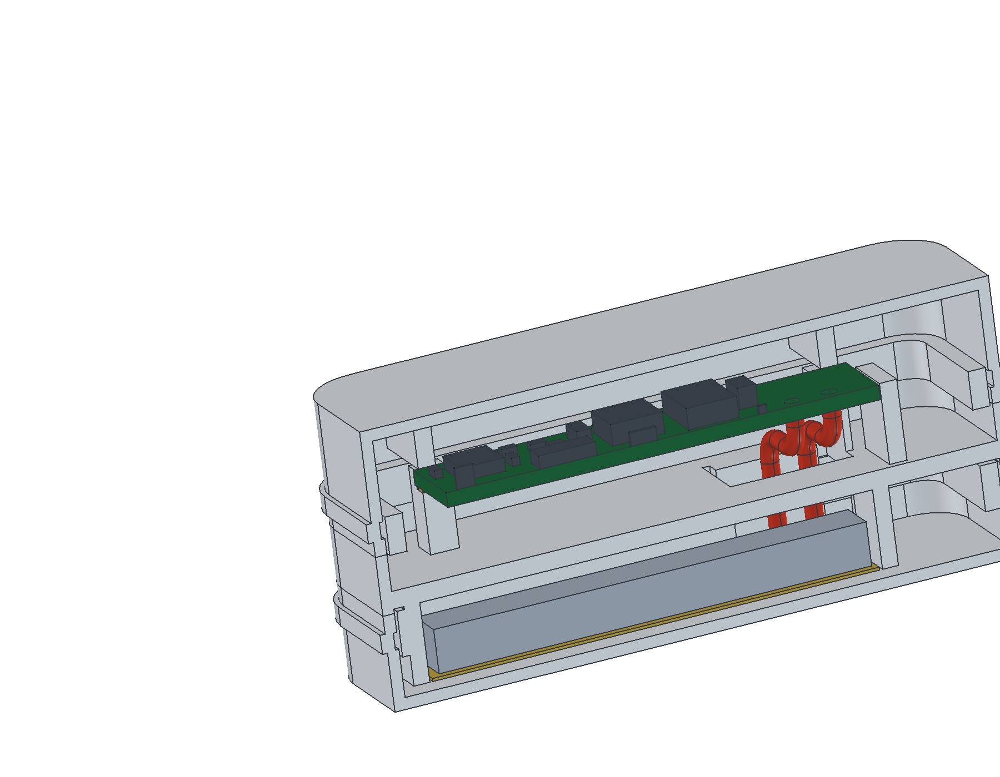
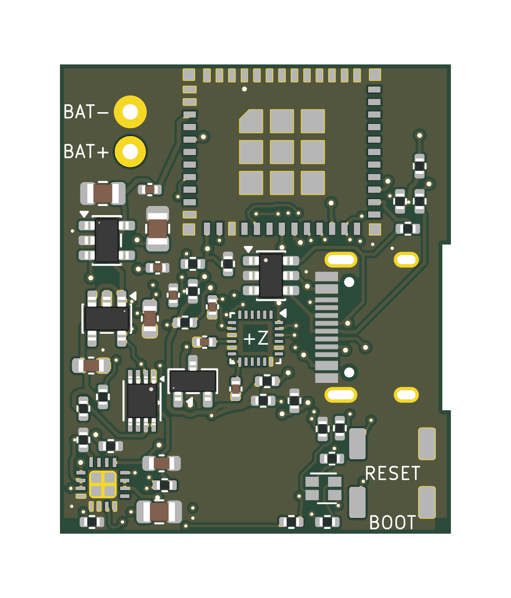

# Screwless PCB + three-piece enclosure — review delivery

**Implemented from aligned predecessor `b8f2836ac2fb26fc0bf774b803c6613a79e66f1b`. No advisor used, no merge performed. Physical fit, manufacture and charging remain unreleased.**

## Design delivered

- H1 footprint/3.2 mm NPTH and H1 copper keepout removed. Copper zones refilled. Existing tracks/vias were already complete; no blind routing generator, circuit changes or gratuitous route replacement.
- Three white rounded prints: **Midframe, Top cover, Bottom cover**. No screw, nut, threaded insert, bearing boss or enclosure mounting hole remains in the active assembly. USB's two 0.65 mm connector locating holes and plated USB/BAT holes are intentionally preserved as part of the electrical footprint.
- Midframe locates the accepted battery allowance below its separator and the current PCB above it. Insulated support lands, optional controlled adhesive and cover travel stops prevent the design from relying on PCB/pouch screw compression.
- Explicit west separator/locator passage, vertical adhesive strain-relief land, connected wire reserve and two conditional OD1.2 mm/R2 mm centerline-bend lead envelopes reaching unchanged BAT pads. The actual vendor pack lead exit remains unknown; no fictitious vendor harness is claimed.
- Native aligned RESET/BOOT, LED and USB plug reserve drive the access checks. Switch access holes are 2.9 mm (0.85 mm web), centered at case (21.25,14.75) / (21.25,11.0). LED center is (16.85,11.9), diameter3.8. All are recessed accesses, not a new actuator design.
- Default 0.8 mm ordinary outer wall/roof/floor; 1.2 mm separator/sleeves and reinforced snap grooves. Live FreeCAD `Parameters.Wall` actually changes all three solids. Default overall **44.3×33.3×19.0 mm LWH**; checked alternative **45.1×34.1×19.4 mm** at 1.2 mm wall. Additional width relative to the old case is deliberate wire/insulation/fit space, not a smaller-package claim.

## Evidence and validation

| Evidence | Result / scope |
|---|---|
| `drc.json` | 0 configured violations, 0 unconnected, 0 schematic parity issues; all-track-errors and severity-all used |
| `erc.json` | 0 configured violations on all five schematic sheets |
| `native-verification.json` | Complete segment/via/footprint token trees, outline, layers/setup, remaining keepouts and protected source hashes checked against predecessor |
| `pcb-invariants.json` | 1,726 tracks +97 vias, 233 pad records and47 poses retained; only H1 and its rule removed, fill recomputed |
| `electrical-rule-scope.json` | Inherited ignored defaults and exclusions recorded; no changed rule severity or blanket electrical release claim |
| `housing/validation/mechanical.json` | **536 passing checks at 0.8 mm**: one valid closed solid per print; zero nominal part/component/pack/wire collisions; access, RF exclusion, wire connectivity, insertion samples, export and wall samples |
| `housing/validation/wall-1.2.json` | Same **536 checks pass at 1.2 mm**, isolated regeneration |
| `housing/validation/native-parameter.json` | Reopen FCStd, change live Wall0.8→1.2, compare all three volumes to independent 1.2 regeneration, restore; STL closed/manifold/oriented/single-component and matching native volumes |
| `housing/validation/renders.json` | Pinned FreeCAD GUI BRep raster exports; FCStd styling saved, hash matches independent native verification |
| `delivery-manifest.json`, `PCB/main/dist/manifest.json`, `housing/dist/manifest.json` | Current file hashes; `changed-paths.txt` is the complete path list |

Checks are nominal CAD tests, not statistical coverage or a physical tolerance stack. Cover installation samples deliberately remove the known snap rails from rigid collision testing: their **0.12 mm insertion flex is intentional and unproven**. Seated parts have no overlap. PCB insertion is checked upward with covers off; battery insertion is checked downward with bottom cover off. Sampled assembly paths are not a continuous deformable simulation.

The exact current KiCad board-only STEP supplies the PCB face, including true slot/peg holes and USB edge recess. It uses drill origin(100,135), translated into the housing's Y=139−nativeY frame. The exported dielectric-only thickness0.91 mm is not substituted for the accepted total-board1 mm envelope. This export-frame distinction is verified, documented and does not change the electronics.

### CAD review images

White geometry is printable plastic; green is the PCB; dark gray boxes are conservative electronic envelopes; silver is an **unqualified candidate battery**; red is the **conditional harness envelope**. Gold represents insulation. Only the three white final shapes are prints. Exploded offsets are visual separation, not a proposed installation path.

The midframe top/bottom images are also in `housing/dist/`. Visual review confirmed no central screw/boss, three distinct prints, rounded shell, aligned switch accesses, and a real separator opening with conditional leads reaching BAT. PCB installed-model render omits unavailable module/switch/USB models; native footprint and envelope checks, not image completeness, establish positions.

## Thickness / regeneration

Edit **`housing/screwless.json` → `outer_wall_mm`** and follow [the full regeneration commands](../../../housing/README.md#set-thickness-and-regenerate). Default is 0.8, tested alternative1.2. `Parameters` spreadsheet **B1 / Wall** allows an actual interactive solid recompute, but JSON must match before regenerating exports. Other mechanical changes need fresh checks; do not treat every diagnostic spreadsheet field as a fully coupled redesign.

Current implementation paths:

- `scripts/r2/screwless/{pcb,verify,seal}.py`: targeted ECO, full native comparisons, current evidence manifests.
- `scripts/r2/enclosure/screwless.py`, `housing/entry.py`, `housing/screwless.json`: current three-piece CSG generator and parameters.
- `scripts/r2/enclosure/extract.py`: native poses/holes/rules and drill origin; `scripts/r2/final/export.py`: current PCB export/assembly prose.
- `housing/{render,check_native}.py`, the two current macros: presentation and live-parameter/mesh verification.
- `PCB/main/smove-r2-main.kicad_pcb`, `interface.json`, `native-layout-contract.json`, `dist/`: PCB and outputs.
- `housing/smove-r2-enclosure.FCStd`, `dist/`, `validation/`, `BOM.csv`, `status.json`: native design, STEP/STL/images and evidence.
- Root/PCB/housing READMEs and printing guide: current instructions. `button-alignment` is explicitly historical; superseded active prose/reports are preserved under its `historical-active-snapshot/`.

Old two-part generator implementations were not rewritten into a new architecture: they are marked historical, and the current dispatcher selects the new local generator. Historical sync now refuses screwless inputs instead of overwriting the interface with M3 claims. Other legacy routing/recovery scripts were **not executed**. Unrelated carrier/electrical history is unchanged.

## Cost-conscious summary

- No fastener purchases, inserts, captive nuts or fastener-installation operations. No extra fitted electronics or battery connector were added; BOM/CPL remain the accepted46 electronic parts.
- Modeled plastic volume is approximately **7.52 cm³ at 0.8 mm**, versus **9.72 cm³ at 1.2 mm** — about23% less solid material for the thinner option. These exclude supports/brim, print waste, shipping and reprints; no price or strength equivalence is claimed.
- Three prints and a supported midframe may cost more print/handling time than the old two-piece concept despite removing hardware. Test fit/snap samples before a full set, and prefer a successful supported print over an unverified thinner or bridge-heavy design.

## Remaining physical gates

Read [the detailed unpowered assembly/acceptance guide](../../../housing/PRINTING-ASSEMBLY.md). In particular: qualify actual pack dimensions, lead exit and swelling/charging limits; print supports/fit/snaps/creep; insulation/adhesive/strain relief and pull testing; PCB button-load deflection/IMU stability; actual USB/button/LED access; RF/on-body/magnetic/thermal behavior. Do not force a pack into the allowance or use it as a structural spacer. The accepted compact antenna exclusion is retained, **not full RF clearance compliance**.

**No claim of proven physical fit or charging safety. Review-only delivery; no merge.**
