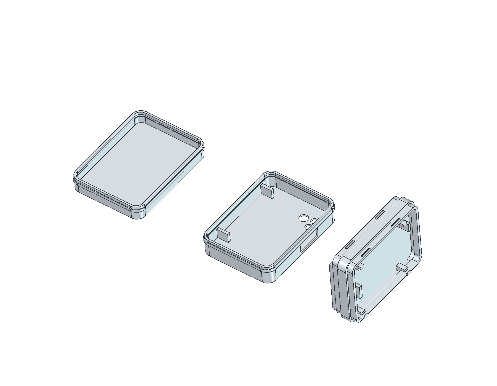

# Three screwless prints — white rounded shell

**Current review design: Midframe + Top cover + Bottom cover. No screws, nuts, inserts or PCB mounting holes. Not released for manufacture or charging.**

The default exterior envelope including the reinforced snap bands is **44.3 L × 33.3 W × 19.0 H mm**. Ordinary outer walls, roof and floor are **0.8 mm**. The rounded footprint has an inner corner radius of 3 mm; exterior offsets follow wall thickness. Snap groove bands add local reinforcement rather than thinning the wall below the configured nominal value.

- **Midframe** separates the pouch from the electronics with a 1.2 mm insulating barrier. Battery pocket below; insulated PCB lands and loose-clearance edge locators above. Top-cover stops limit PCB lift without preload. PCB adhesive is optional, not a substitute for insulation.
- **Covers** push onto the midframe sleeves with short ramped snap rails. Sleeve radial clearance 0.18 mm; nominal insertion flex 0.12 mm; seated groove radial clearance 0.12 mm. These are CAD dimensions, **not proven printer tolerances or retention forces**.
- **Battery** candidate 30×20×3 mm; accepted complete-pack allowance 31×21×4.3 mm is unchanged. Pocket is 21.4×31.4 mm between flat locators, with 0.7 mm clearance between the allowance top and separator. Cover closure reacts at perimeter stops, not the pouch. Exact pack, lead exit and swelling requirements remain unknown/unqualified.
- **Wire passage** is explicitly cut through the west midframe separator/locator. A contiguous reserved volume and two conditional OD1.2/R2-bend lead envelopes reach the unchanged BAT pads. No lead or pack enters the retained north antenna exclusion. An upstream adhesive strain-relief land is provided; no approved adhesive/harness is implied.
- **Access** uses native RESET/BOOT/LED anchors and the native USB plug envelope. RESET/BOOT remain aligned at native X121.25 mm and 3.75 mm pitch. Their 2.9 mm access holes leave a 0.85 mm web; these are recessed tool-access openings, not finger buttons. LED aperture is 3.8 mm.

## Current files

| File | Purpose |
|---|---|
| `smove-r2-enclosure.FCStd` | Editable CSG and live `Parameters.Wall` spreadsheet; exactly three final objects with Role=`print` |
| `dist/midframe.stl` | Frame in east-edge-down starting print orientation; supports/brim required |
| `dist/top-cover.stl` | Roof down |
| `dist/bottom-cover.stl` | Floor down |
| `dist/smove-r2-printable.step` | Exactly three closed printable solids in assembled coordinates |
| `dist/smove-r2-assembly.step` | Prints plus electronic/film/battery/conditional lead reference envelopes; not all are prints |
| `validation/mechanical.json`, `wall-1.2.json` | Default and alternate-wall geometric checks |
| `validation/native-parameter.json` | Reopened native, live spreadsheet sweep and independent mesh checks |
| `dist/assembled.png`, `exploded.png`, `print-three.png`, `section.png` | FreeCAD BRep review images, not physical prototypes |

## Set thickness and regenerate

1. Edit **`housing/screwless.json` → `outer_wall_mm`**, default `0.8`. Supported checked range is 0.8–1.2 mm. Keep dimensions in mm. Wall growth is outward, preserving battery, PCB and access datums; the roof grows upward and floor grows inward into the reserved floor clearance.
2. From the repository root, with the pinned runtime installed:

```sh
/usr/bin/python3 scripts/freecad/bootstrap.py --verify-only
# Only if not installed: /usr/bin/python3 scripts/freecad/bootstrap.py
/usr/bin/python3 scripts/r2/final/export.py
/usr/bin/python3 scripts/r2/enclosure/extract.py
/usr/bin/python3 scripts/freecad/run.py housing/entry.py generate
/usr/bin/python3 scripts/freecad/run.py housing/entry.py generate 1.2
cp .cache/wall-1.2/validation/mechanical.json housing/validation/wall-1.2.json
/usr/bin/python3 scripts/freecad/run.py housing/check_native.py
```

`generate 1.2` writes only `.cache/wall-1.2/`, never overwriting the default delivery. `check_native.py` is specifically a **0.8→1.2→0.8 test**: run it on the default 0.8 delivery; for a new default, adapt the sweep test deliberately. `housing/entry.py verify` currently regenerates and verifies (it is **not read-only**).

3. For interactive wall edits, open the FCStd, double-click `Parameters`, change **B1 / alias Wall**, and recompute. All three final solids actually change. Persist the same value in JSON and regenerate exports: a GUI-only edit does **not** update delivered STL/STEP/images. Other spreadsheet datums are diagnostic, not a fully coupled mechanical redesign; change other settings in JSON/code and revalidate. In particular, fit/snap settings require regeneration, not just spreadsheet edits.
4. Render in a valid authorized X11 desktop session:

```sh
/usr/bin/python3 scripts/freecad/run.py housing/render.py
/usr/bin/python3 scripts/freecad/run.py housing/check_native.py
/usr/bin/python3 scripts/r2/screwless/seal.py
```

The renderer inherits `DISPLAY` and `XAUTHORITY` from your desktop; do not copy another session's credentials. It briefly opens the pinned FreeCAD GUI, exports images, saves assembled white styling, then closes its own window. Do not run concurrently with unsaved edits to this FCStd. The inspection macro offers visibility controls without changing engineering poses.

**Never run legacy PCB routing generators to regenerate this housing.** The targeted one-time H1 ECO is `scripts/r2/screwless/pcb.py`. Current native-board exports and `extract.py` are read-only with respect to PCB routing. `scripts/r2/integrated/sync.py` now refuses the screwless board rather than reintroducing historical mounting claims. Old enclosure `generate.py`, `verify.py`, `present.py` and recovery tools describe historical revisions; current entry is `housing/entry.py`.

See [printing/assembly and physical gates](PRINTING-ASSEMBLY.md), [revision evidence](../docs/revision-r2/screwless/README.md), and [BOM](BOM.csv). No advisor was used; no merge performed.



